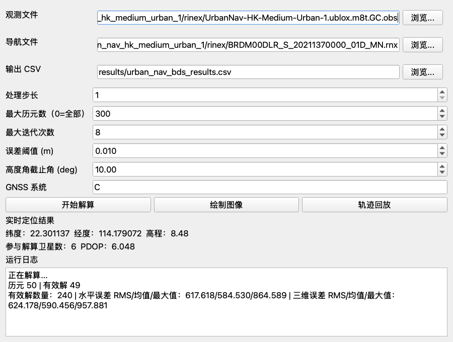
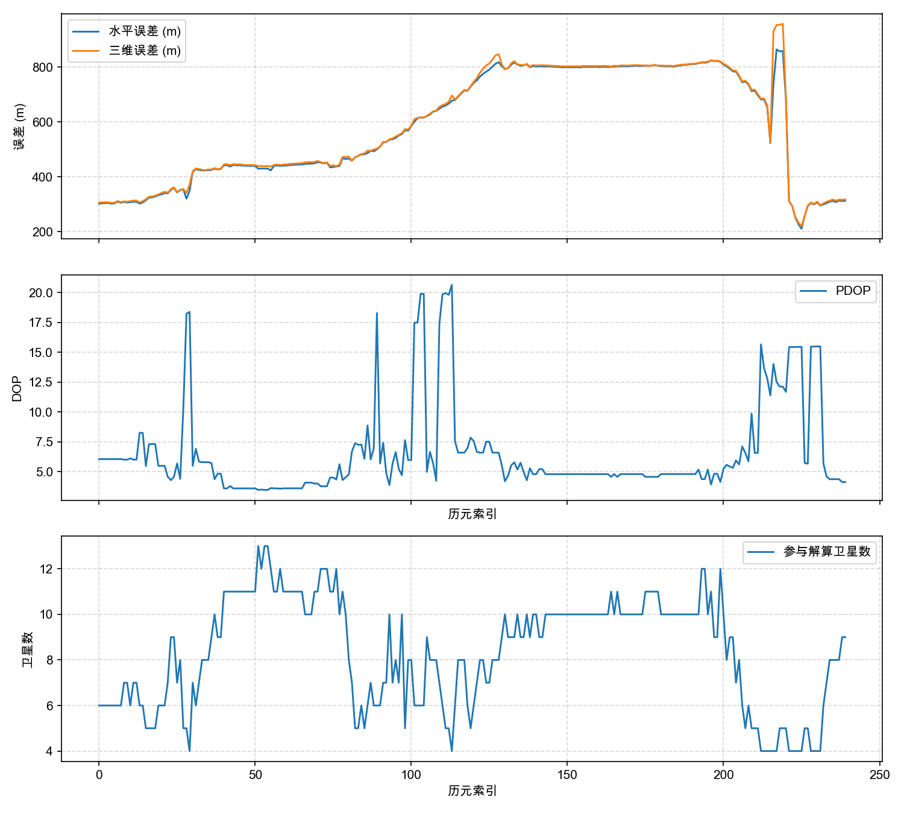
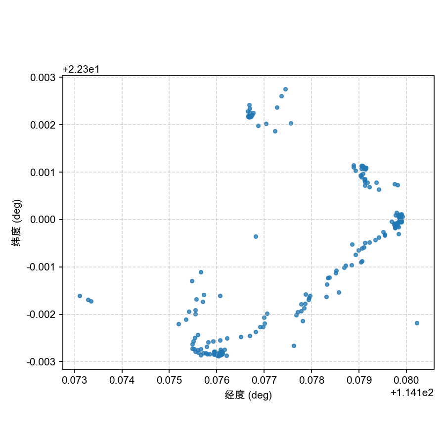
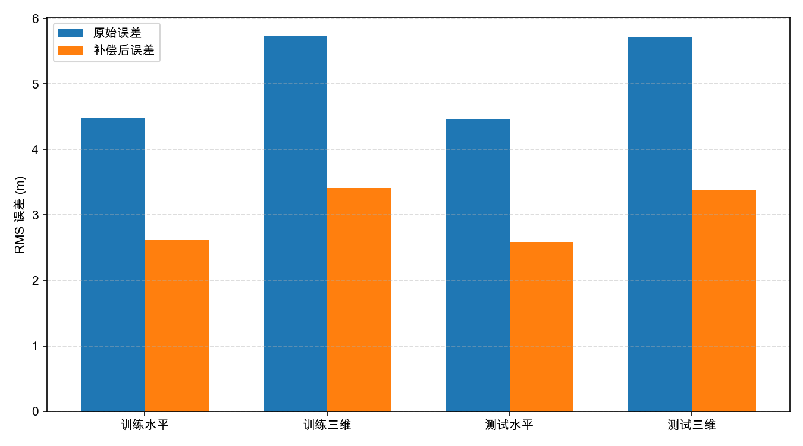

# 北斗定位解算实验

本仓库实现 RINEX 观测/导航数据到 GNSS 单点定位结果分析的完整流程，支持 GPS、BDS 与 GPS+BDS 联合解算，提供命令行脚本、PyQt GUI、测试数据、结果图表和 LaTeX 实验报告。

GitHub 仓库：<https://github.com/tortrixx/beidou-positioning-experiment>

## 提交材料

| 内容 | 路径 |
| --- | --- |
| 源码 | `src/`, `scripts/`, `tests/` |
| 测试数据 | `data/sample/`, `data/datasets/` |
| 结果图表 | `reports/latex/figures/`, `results/datasets/`, `results/ml_compensation/` |
| LaTeX 报告 | `reports/latex/main.tex` |
| Markdown 备份报告 | `reports/final_*.md`, `reports/project_explanation_guide.md` |

Overleaf 编译报告时上传整个 `reports/latex/` 目录，主文件选择 `main.tex`，编译器选择 `XeLaTeX`。

## 快速复现

### 1. 下载代码

```bash
git clone https://github.com/tortrixx/beidou-positioning-experiment.git
cd beidou-positioning-experiment
```

### 2. 创建环境

macOS / Linux：

```bash
python3 -m venv .venv
source .venv/bin/activate
python -m pip install --upgrade pip
python -m pip install -r requirements.txt
```

Windows PowerShell：

```powershell
py -3 -m venv .venv
.\.venv\Scripts\Activate.ps1
python -m pip install --upgrade pip
python -m pip install -r requirements.txt
```

如果 Windows 禁止执行激活脚本，可先运行：

```powershell
Set-ExecutionPolicy -Scope Process -ExecutionPolicy Bypass
```

### 3. 运行基础样例

检查 RINEX 文件：

```bash
python scripts/inspect_rinex.py --obs data/sample/bjfs1170.26o --nav data/sample/brdc1170.26n
```

单历元定位：

```bash
python scripts/run_spp.py --obs data/sample/bjfs1170.26o --nav data/sample/brdc1170.26n --epoch 0 --systems G
```

连续定位并生成 CSV 与图片：

```bash
python scripts/run_continuous.py --obs data/sample/bjfs1170.26o --nav data/sample/brdc1170.26n --systems G --max-epochs 200 --csv results/demo/results.csv --plot --save-plots results/demo
```

运行自动化测试：

```bash
python -m unittest tests.test_experiment_modules -v
```

### 4. 运行北斗数据样例

UrbanNav 城市动态 BDS 数据：

```bash
python scripts/run_continuous.py --obs data/datasets/urban_nav_hk_medium_urban_1/rinex/UrbanNav-HK-Medium-Urban-1.ublox.m8t.GC.obs --nav data/datasets/urban_nav_hk_medium_urban_1/rinex/BRDM00DLR_S_20211370000_01D_MN.rnx --systems C --max-epochs 300 --csv results/demo_urban_bds/results.csv --plot --save-plots results/demo_urban_bds
```

TWTF GPS+BDS 联合解算：

```bash
python scripts/run_continuous.py --obs data/datasets/twtf_2026_117_mixed/rinex/TWTF00TWN_R_20261170000_01D_30S_MO.rnx --nav data/datasets/twtf_2026_117_mixed/rinex/BRDM00DLR_S_20261170000_01D_MN.rnx --systems G,C --max-epochs 300 --csv results/demo_twtf_gps_bds/results.csv --plot --save-plots results/demo_twtf_gps_bds
```

### 5. 启动 GUI

```bash
python scripts/gui_app.py
```

GUI 中可以选择 RINEX 观测文件和导航文件，设置最大历元数、迭代次数、误差阈值、高度角和 GNSS 系统，然后点击：

```text
开始解算 -> 绘制图像 -> 轨迹回放
```

推荐 GUI 演示数据：

```text
观测文件：data/datasets/urban_nav_hk_medium_urban_1/rinex/UrbanNav-HK-Medium-Urban-1.ublox.m8t.GC.obs
导航文件：data/datasets/urban_nav_hk_medium_urban_1/rinex/BRDM00DLR_S_20211370000_01D_MN.rnx
GNSS 系统：C
最大历元数：300
```

## 演示图

GUI 主界面：



误差/DOP/卫星数曲线与轨迹散点图示例：

| 误差曲线 | 轨迹散点图 |
| --- | --- |
|  |  |

附加题误差补偿结果：



## 数据与结果说明

- `data/sample/`：默认 GPS RINEX 2.11 样例。
- `data/datasets/twtf_2026_117_mixed/`：RINEX 3 mixed 数据，适合 BDS 与 GPS+BDS 演示。
- `data/datasets/urban_nav_hk_medium_urban_1/`：香港城市动态数据，适合展示 `.obs`、BDS 和复杂场景容错。
- `data/datasets/redundancy_stress_2026_117/`：压缩格式与容错测试数据。
- `results/datasets/`：已生成的连续定位 CSV、误差曲线和轨迹图。
- `results/ml_compensation/`：附加题线性回归误差补偿模型与图表。

说明：UrbanNav 是动态城市数据，RINEX 头文件近似坐标不是固定真值轨迹，因此其误差统计主要用于验证复杂数据处理能力，不等同于静态测站精度。

## 常用命令

批量汇总结果：

```bash
python scripts/run_batch.py --output results/summary.csv
```

训练附加题误差补偿模型：

```bash
python scripts/train_error_model.py --output-dir results/ml_compensation
```

运行冗余/容错测试：

```bash
python scripts/run_redundancy_tests.py --max-epochs 20 --output results/redundancy_tests/summary.csv
```

## 支持范围

- 支持普通 RINEX 观测/导航文件：`.o`, `.obs`, `.n`, `.nav`, `.rnx`, `.gz`
- 当前定位解算入口支持 `G`、`C`、`G,C`
- Hatanaka `.crx/.d` 文件会被识别并提示先转换为普通 RINEX
- 核心算法手写实现，第三方库仅用于 GUI、绘图和基础运行
