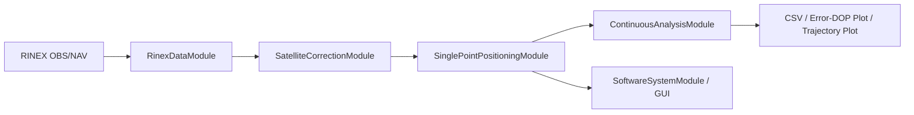

# Design Report (Partial)

## 1. Requirement Analysis
- Import RINEX observation and navigation files, including the original GPS sample data and RINEX 3 mixed data.
- Provide configurable SPP parameters: iteration count, convergence threshold, elevation mask, GNSS system selection, and residual gate.
- Output real-time/continuous positioning results, CSV files, error curves, DOP curves, and trajectory plots.
- Organize the software around the five experiment modules required by the lab.

## 2. Functional Modules
| Lab module | Implementation | Responsibility |
| --- | --- | --- |
| RINEX data import | `RinexDataModule` | Load obs/nav files, validate headers, expose epochs and navigation records |
| Satellite correction | `SatelliteCorrectionModule` | Select ephemeris, compute satellite ECEF/clock, apply ionosphere and troposphere corrections |
| SPP solver | `SinglePointPositioningModule` | Filter usable satellites, solve iterative least squares, compute PDOP/GDOP |
| Continuous analysis | `ContinuousAnalysisModule` | Compute ENU/3D errors, summarize statistics, export CSV and plots |
| Software system | `SoftwareSystemModule`, CLI scripts, GUI | Integrate full workflow and user-facing parameter controls |

## 3. Data Flow

## 4. BDS Support Design Status
- RINEX 3 mixed observation records are parsed with per-system observation types.
- RINEX 3 mixed navigation records parse GPS and BDS records, while short SBAS/unsupported records are skipped safely.
- BDS `BDSA/BDSB` ionospheric coefficients are parsed and selected for BDS Klobuchar correction.
- BDS GEO satellites C01-C05 use a dedicated GEO orbit transformation branch.
- BDS satellite propagation converts mixed-file GPST epochs to BDT with the correct sign before ephemeris selection and orbit calculation.
- BDS-only SPP uses a wider default post-fit residual gate and receiver-state sanity checks to prevent divergent iterations from entering the atmospheric model.
- GPS+BDS joint SPP expands the least-squares state from `[x, y, z, receiver_clock]` to `[x, y, z, clock_G, clock_C, ...]`, allowing inter-system clock bias to be estimated naturally.
- The least-squares normal equations use elevation-angle weights, and each solution records post-fit residual RMS/max values for diagnostics.

## 5. Current Design Limits
- GPS-only SPP is the validated precision baseline.
- BDS-only and GPS+BDS full-day processing are validated on the TWTF mixed dataset.
- More BDS stations/days are needed to verify generality.
- CN0/SNR-based weighting and long-term satellite residual statistics remain planned improvements.
