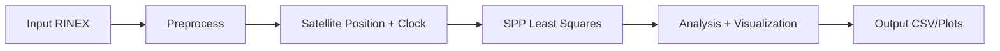

# Design Report Template

## 1. Requirement Analysis
- Objectives
- Input data and formats (RINEX 2.11 obs/nav)
- Output requirements (positioning, accuracy, plots)

## 2. Functional Design
- Module breakdown
- Data flow

## 3. Architecture
- Module responsibilities
- Interfaces between modules

## 4. Data Structures
- Observation header/epoch model
- Navigation record model
- Solution model

## 5. Key Algorithms
- Broadcast ephemeris to ECEF
- Clock correction + relativistic term
- Troposphere + ionosphere correction
- Iterative least squares

## 6. Limitations and Extensions
- Current GNSS systems
- Planned extensions (BDS/GLONASS)
