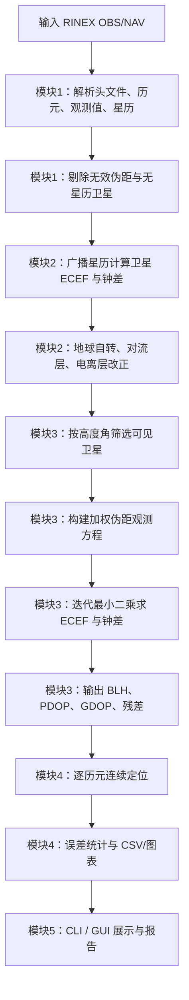

# 北斗定位解算全流程软件系统设计报告

## 1. 需求分析

本实验要求基于 RINEX 观测文件和广播星历文件，完成北斗/GNSS 单点定位解算全流程软件系统。系统需要实现 RINEX 数据解析、卫星位置与钟差计算、伪距单点定位、连续定位分析、结果可视化和 GUI 交互。

本项目使用 Python 实现，核心定位算法、广播星历轨道计算、最小二乘求解、坐标转换等均为手写实现，没有调用第三方定位库。第三方库仅用于 GUI 和绘图。

## 2. 软件总体结构

系统采用五模块结构，与实验文档要求一一对应：

| 实验模块 | 高层封装 | 主要文件 | 功能 |
| --- | --- | --- | --- |
| RINEX 数据解析 | `RinexDataModule` | `src/rinex_obs.py`, `src/rinex_nav.py` | 解析观测值、SNR、星历、时间与测站信息 |
| 卫星位置与钟差计算 | `SatelliteCorrectionModule` | `src/satellite.py`, `src/atmosphere.py` | 广播星历位置、钟差、对流层/电离层改正 |
| 单点定位解算 | `SinglePointPositioningModule` | `src/positioning.py`, `src/coords.py` | 加权迭代最小二乘、DOP、ECEF/BLH |
| 连续定位与结果分析 | `ContinuousAnalysisModule` | `src/pipeline.py`, `src/analysis.py`, `src/plotting.py` | 连续解算、误差统计、CSV、图像 |
| 软件系统整合 | `SoftwareSystemModule` | `scripts/*.py`, `scripts/gui_app.py` | CLI、GUI、批量测试入口 |

## 3. 系统流程图



## 4. 数据结构设计

主要数据结构位于 `src/models.py`：

- `ObsHeader`：保存 RINEX 观测文件版本、测站名、近似坐标、观测类型、首历元时间和时间系统。
- `ObsEpoch`：保存单历元时间、历元标志和各卫星观测字典。
- `NavRecord`：保存单颗卫星一组广播星历，包括轨道参数、钟差参数、健康状态等。
- `NavHeader`：保存电离层参数、闰秒和 RINEX 3 `IONOSPHERIC CORR` 参数。
- `PositionSolution`：保存定位结果 ECEF、BLH、接收机钟差、使用卫星、PDOP/GDOP、残差 RMS/Max。

## 5. 关键算法设计

### 5.1 RINEX 解析

RINEX 2.11 使用 `# / TYPES OF OBSERV` 获取观测类型；RINEX 3 使用 `SYS / # / OBS TYPES` 按系统保存观测类型。观测值按 16 字符字段解析，并按历元组织为卫星观测字典。导航文件解析星历参数和 RINEX 3 `GPSA/GPSB/BDSA/BDSB` 电离层参数。

### 5.2 卫星位置与钟差

广播星历计算过程包括：

1. 根据发射时刻选择最近星历；
2. 计算平均角速度、平近点角、偏近点角、真近点角；
3. 使用 `cuc/cus/crc/crs/cic/cis` 完成摄动修正；
4. 转换到 ECEF 坐标系；
5. 对 BDS GEO 卫星 C01-C05 使用专用 GEO 转换；
6. 计算钟差多项式、相对论修正和 TGD 改正。

BDS 星历使用 BDT 时间系统。混合 RINEX 文件多以 GPST 标注观测时刻，程序在 BDS 星历选择和传播时将 GPST 正确转换为 BDT。

### 5.3 加权迭代最小二乘

单点定位观测方程为：

```text
P_i - correction_i = rho_i + c * dt_r + v_i
```

对于 GPS+BDS 联合解算，状态向量扩展为：

```text
[dx, dy, dz, clock_G, clock_C, ...]
```

程序按高度角设置权重：

```text
w_i = max(sin(elevation_i)^2, 0.05)
```

并构建加权法方程：

```text
(H^T W H) dx = H^T W v
```

残差门限用于剔除明显粗差；解算后保存后验残差 RMS 和最大残差，便于调试和报告分析。

## 6. GUI 设计

GUI 使用 PyQt5，主界面提供：

- RINEX 观测文件与导航文件选择；
- 输出 CSV 路径设置；
- 步长、最大历元数、最大迭代次数、误差阈值、高度角、GNSS 系统参数；
- 运行过程实时显示纬度、经度、高程、使用卫星数、PDOP；
- 误差曲线查看与轨迹回放。


## 7. 程序清单

```text
src/
  analysis.py              误差计算与统计
  atmosphere.py            对流层与电离层改正
  constants.py             物理常数与系统常数
  coords.py                ECEF/BLH/ENU 坐标转换
  experiment_modules.py    五个实验模块封装
  models.py                核心数据结构
  pipeline.py              连续解算流水线与 CSV 输出
  plotting.py              误差/DOP/卫星数曲线与轨迹图
  positioning.py           SPP 加权最小二乘核心
  rinex_nav.py             RINEX 导航文件解析
  rinex_obs.py             RINEX 观测文件解析
  satellite.py             广播星历卫星位置与钟差
  time_utils.py            GPS/BDT 时间工具
scripts/
  gui_app.py               PyQt GUI
  inspect_rinex.py         RINEX 文件检查
  plot_results.py          CSV 结果绘图
  run_continuous.py        连续定位 CLI
  run_spp.py               单历元定位 CLI
```

## 8. 设计小结

系统已形成清晰的模块边界：解析、改正、解算、分析、交互互不混杂。GPS、BDS 和 GPS+BDS 联合定位均可运行，满足基础题的软件系统设计要求。后续可继续扩展 CN0/SNR 权重、更多数据集自动批处理和附加题机器学习误差补偿。
