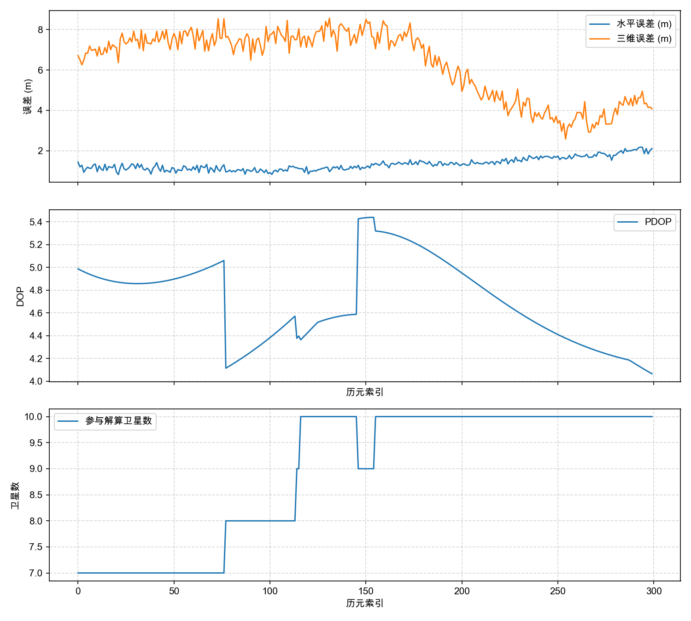
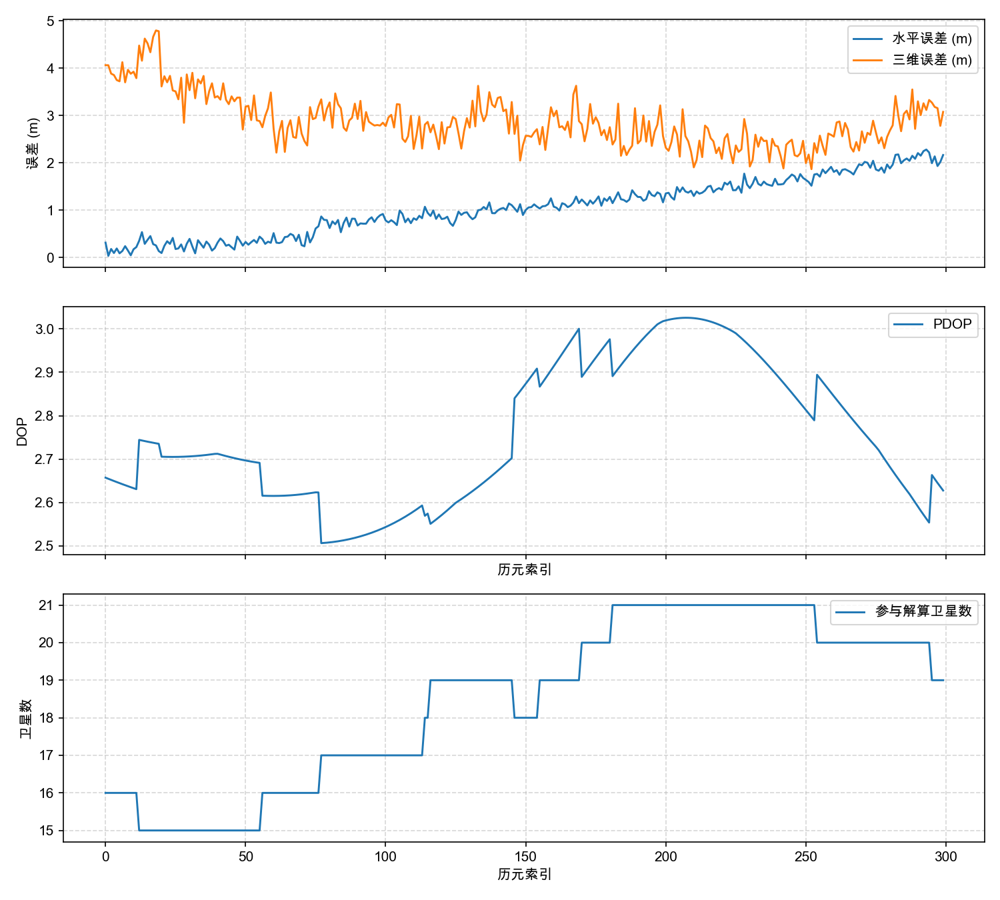

# 北斗定位解算全流程软件系统开发实验报告

## 1. 实验目的

本实验围绕北斗/GNSS 卫星导航定位原理，使用软件编程完成从 RINEX 数据读取到定位结果分析的完整流程。实验目标包括：

1. 掌握 RINEX 观测文件和广播星历文件的解析方法；
2. 掌握广播星历卫星位置、卫星钟差和传播延迟修正方法；
3. 掌握伪距单点定位观测方程和迭代最小二乘解算；
4. 实现连续定位、误差统计、轨迹与误差可视化；
5. 完成可交互的软件系统，并用多组数据进行测试。

需要用到的知识包括卫星导航定位原理、坐标系转换、最小二乘估计、误差传播、Python 模块化编程、GUI 编程和数据可视化。

## 2. 实验方法和步骤

实验采用 Python 编写完整软件系统，流程如下：

1. 读取 RINEX 观测文件和导航文件；
2. 按历元提取卫星编号、伪距、SNR、星历参数；
3. 剔除不健康卫星、无效伪距和低高度角卫星；
4. 根据广播星历计算卫星 ECEF 坐标和卫星钟差；
5. 进行地球自转、对流层、电离层修正；
6. 建立伪距定位方程，使用加权迭代最小二乘求解接收机位置和钟差；
7. 将 ECEF 坐标转换为经纬高；
8. 对连续历元重复解算，保存结果并计算误差统计；
9. 生成误差/DOP/卫星数曲线、轨迹图和测试报告；
10. 使用 GUI 完成数据导入、参数设置、实时显示和轨迹回放。

## 3. 软件总体设计

软件采用五模块结构：


各模块职责如下：

- 模块1：解析 RINEX OBS/NAV，生成统一数据结构；
- 模块2：计算卫星位置、钟差、对流层和电离层修正；
- 模块3：完成可见卫星筛选、PDOP/GDOP 计算、定位解算；
- 模块4：进行连续定位、误差统计和图表输出；
- 模块5：整合 CLI、GUI 和批量测试流程。

## 4. 详细设计与实现

### 4.1 RINEX 数据解析模块

观测文件解析器支持 RINEX 2.11 和 RINEX 3。RINEX 2.11 通过 `# / TYPES OF OBSERV` 读取观测类型，RINEX 3 通过 `SYS / # / OBS TYPES` 按系统读取观测类型。每个历元保存为 `ObsEpoch`，其中 `sat_obs` 字典以卫星编号为键，保存伪距、载波相位、SNR 等观测值。

导航文件解析器将广播星历保存为 `NavRecord`，包括半长轴平方根、偏心率、倾角、升交点赤经、近地点角、钟差参数、TGD 和健康状态等。RINEX 3 中的 `BDSA/BDSB` 电离层参数也会被解析。

### 4.2 卫星位置与钟差模块

卫星位置计算使用广播星历公式。程序先计算平均角速度、平近点角、偏近点角和真近点角，再使用星历中的摄动参数修正升交角距、轨道半径和倾角，最终转换到 ECEF 坐标系。

BDS 的时间系统为 BDT。对于 RINEX 3 mixed 文件，程序将观测时刻从 GPST 转换到 BDT 后再进行 BDS 星历选择和卫星传播。BDS GEO 卫星 C01-C05 使用专门的 GEO 坐标转换分支。

卫星钟差采用：

```text
dt_sv = af0 + af1 * dt + af2 * dt^2 + relativistic - tgd
```

其中相对论项由偏心率、半长轴平方根和偏近点角计算。

### 4.3 传播延迟修正

对流层延迟使用 Saastamoinen 模型。电离层延迟使用 Klobuchar 模型，GPS 使用 `GPSA/GPSB` 或 RINEX 2 `ION ALPHA/BETA`，BDS 使用 `BDSA/BDSB`。修正后的伪距用于后续定位方程。

### 4.4 单点定位解算模块

定位方程线性化后，采用迭代加权最小二乘求解。权重按高度角设置：

```text
w = max(sin(elevation)^2, 0.05)
```

GPS+BDS 联合定位时，状态向量包含每个系统独立的接收机钟差：

```text
[dx, dy, dz, clock_G, clock_C]
```

这种设计避免 GPS 和 BDS 的系统钟差被强行合并，提高混合系统定位稳定性。每次解算还输出 PDOP、GDOP、残差 RMS 和最大残差。

### 4.5 连续定位与可视化模块

连续定位模块逐历元调用 SPP 解算，并保存结果时间序列。误差分析以 RINEX 头文件的近似测站坐标作为参考，计算 ENU 方向误差、水平误差和三维误差。

可视化输出包括：

- 水平误差与三维误差曲线；
- PDOP 曲线；
- 使用卫星数曲线；
- 经纬度轨迹图。

## 5. 软件运行界面

GUI 主界面如下：


界面可设置观测文件、导航文件、输出 CSV、步长、最大历元、迭代次数、误差阈值、高度角和 GNSS 系统。运行过程中会实时显示最新定位结果、使用卫星数和 PDOP；运行完成后可查看误差曲线并回放轨迹。

## 6. 实验结果

### 6.1 多数据集精度结果

| 数据集 | 系统 | 解算历元 | 水平 RMS/均值/最大值 (m) | 三维 RMS/均值/最大值 (m) |
| --- | --- | ---: | --- | --- |
| BJFS | GPS | 2880 | 1.658 / 1.378 / 4.758 | 4.253 / 3.517 / 10.121 |
| DAEJ | GPS | 2880 | 1.948 / 1.491 / 7.122 | 3.904 / 3.280 / 9.308 |
| HKSL | GPS | 2880 | 3.895 / 3.362 / 7.864 | 5.265 / 4.685 / 13.005 |
| TWTF | GPS | 2880 | 5.779 / 4.434 / 12.705 | 6.598 / 5.531 / 14.513 |
| TWTF | BDS | 2880 | 6.015 / 4.072 / 53.206 | 7.488 / 6.055 / 59.987 |
| TWTF | GPS+BDS | 2880 | 5.347 / 3.979 / 11.681 | 6.029 / 5.175 / 12.411 |

### 6.2 典型图表

UrbanNav BDS 误差、PDOP 与卫星数曲线：


UrbanNav BDS 轨迹散点图：


TWTF BDS-only 误差、PDOP 与卫星数曲线：



TWTF GPS+BDS 误差、PDOP 与卫星数曲线：



## 7. 误差分析

从结果看，GPS 单系统在 BJFS、DAEJ、HKSL 三个站点上均达到米级定位精度。TWTF mixed 数据中，BDS-only 全日三维 RMS 为 7.488 m，GPS+BDS 联合三维 RMS 为 6.029 m。

BDS-only 的最大误差较大，主要原因是部分历元 BDS 可用卫星数较少、PDOP 偏大。统计结果中，TWTF BDS-only 的 PDOP 与三维误差相关系数约为 0.741，说明几何构型对 BDS 单系统误差影响明显。GPS+BDS 联合后平均卫星数增加到 16.36，PDOP 均值降低到 2.815，误差曲线更稳定。

残差诊断显示，多数数据集后验残差 RMS 均值在 0.5 m 到 1.5 m 范围内，说明伪距改正和加权最小二乘总体工作正常。个别站点最大残差偏大，可能与多路径、观测噪声或低高度角卫星有关。

## 8. 调试与问题解决

实验过程中主要遇到并修复了以下问题：

1. 默认数据路径错误，导致脚本开箱运行失败。已统一改为 `data/sample/`。
2. `step=0` 会触发除零。已在 pipeline 入口增加参数校验。
3. Matplotlib 缺失时脚本仍提示保存成功。已让绘图函数返回状态并由脚本判断。
4. RINEX 3 mixed 导航文件中的 BDS 电离层参数未解析。已支持 `BDSA/BDSB`。
5. BDS 时间转换方向错误，导致 BDS 位置偏差。已修正 GPST 与 BDT 转换。
6. GPS+BDS 共用单一接收机钟差导致联合解算偏差。已改为每系统钟差参数。
7. CSV 输出目录不存在时写入失败。已自动创建父目录。
8. 原可视化图缺少卫星数变化。已在误差/DOP 图中增加卫星数曲线。

## 9. 结论

本项目已完成实验基础题要求的五个模块：RINEX 数据解析、卫星位置与钟差计算、单点定位核心算法、连续定位与结果分析、软件系统整合与测试。软件支持 GPS、BDS 和 GPS+BDS 联合定位，能够输出定位结果、精度统计、残差诊断、CSV 文件、误差曲线和轨迹图，并提供 PyQt GUI 交互界面。

目前系统已经达到基础题验收要求。仍可继续改进的方向包括：使用 CN0/SNR 构建更合理的观测权重、加入长期卫星残差统计、扩展更多 BDS 站点和日期数据、完成附加题中的机器学习误差预测与补偿。

## 10. 心得体会

通过本实验，可以明显感受到卫星导航定位不是单一公式计算，而是数据格式、时间系统、坐标系统、误差模型和数值解算共同作用的工程系统。尤其是 BDS 与 GPS 混合解算中，时间系统和接收机钟差建模非常关键。经过逐项调试和多组数据验证后，软件从单 GPS 样例扩展到 BDS-only 与 GPS+BDS mixed 数据，工程完整性和可靠性都有明显提升。

## 11. 程序清单

完整程序清单见 `reports/final_design_report.md` 第 7 节。源码主要位于 `src/` 和 `scripts/`，测试位于 `tests/`，数据与结果分别位于 `data/` 和 `results/`。
