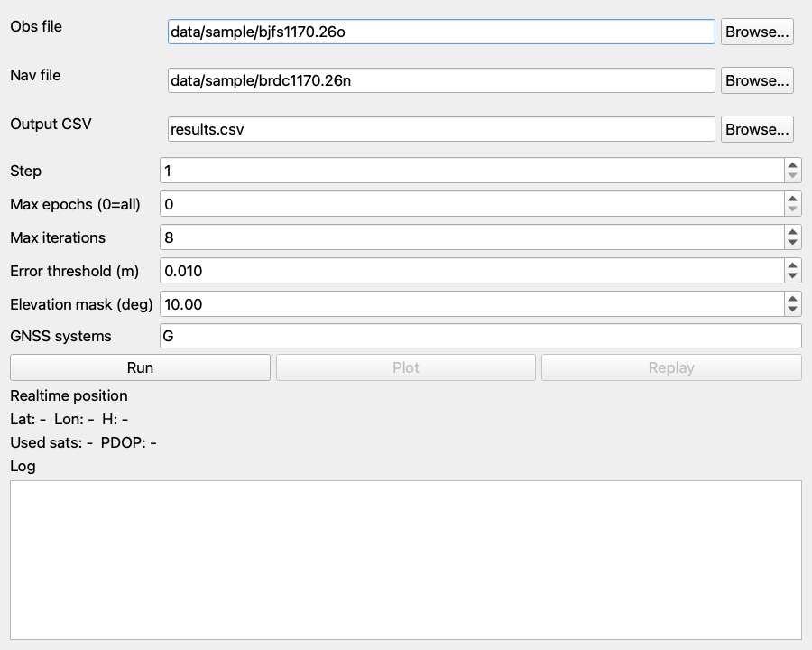
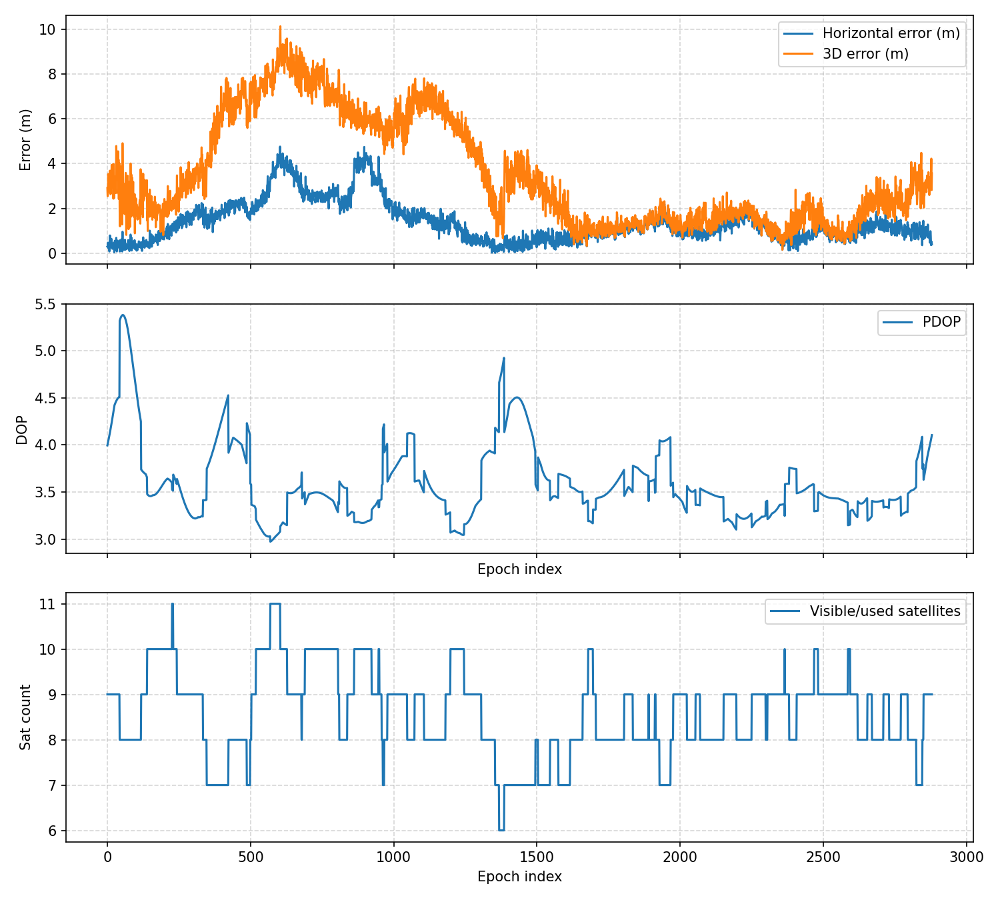
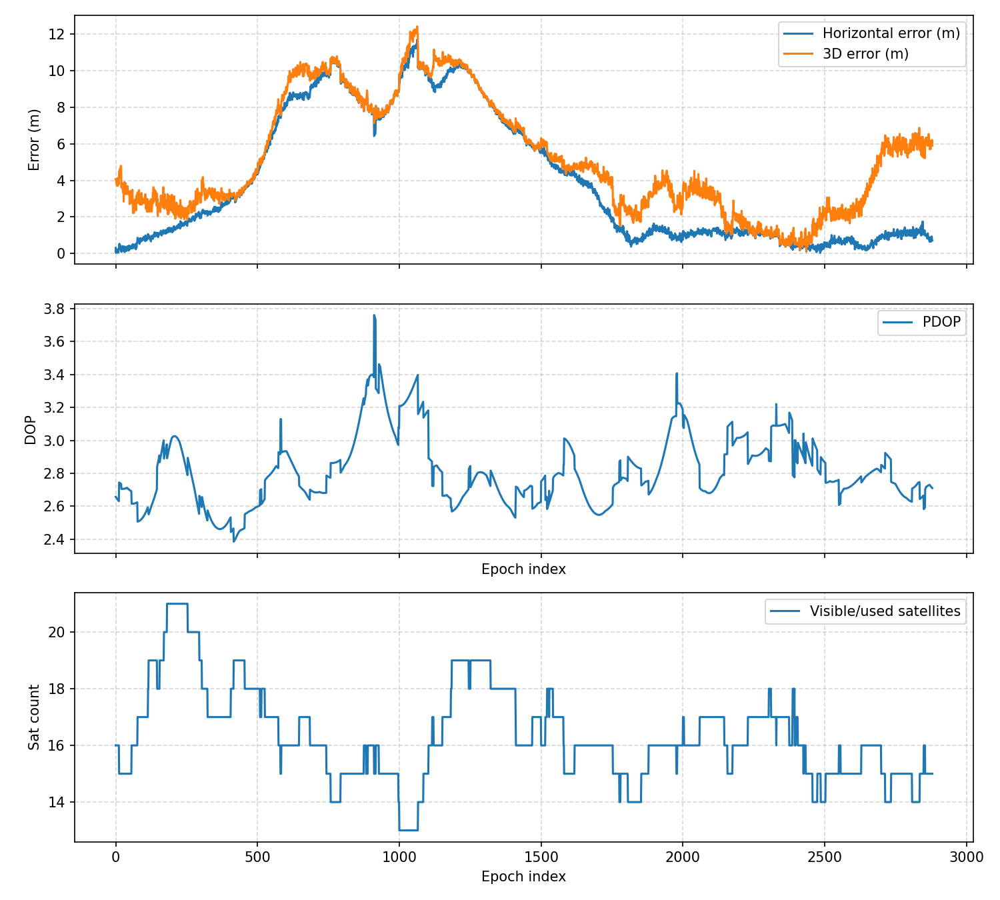
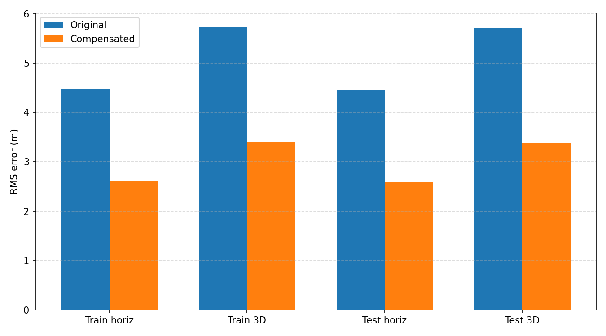

# 北斗定位解算项目讲解与演示导览

## 1. 项目是否完成实验要求

结论：本项目已经完成实验文档中基础题的全部要求，并额外完成了附加题中的“基于线性回归的定位误差预测与补偿”。

基础题完成内容包括：

- RINEX 观测文件与导航文件解析；
- 观测值预处理、无效伪距剔除、不健康卫星剔除、高度角筛选；
- 北斗/GNSS 广播星历卫星位置与钟差计算；
- 对流层和电离层延迟修正；
- 伪距单点定位迭代最小二乘解算；
- ECEF 与经纬高 BLH 坐标转换；
- 连续定位、误差统计、CSV 输出；
- 误差曲线、DOP 曲线、卫星数曲线、轨迹图；
- PyQt GUI，实现数据导入、参数设置、实时显示、绘图和轨迹回放；
- 多组 RINEX 数据测试、结果截图和完整报告；
- 附加题：机器学习误差预测与补偿。

## 2. 项目总体功能

本项目实现一个完整的北斗/GNSS 单点定位软件系统。用户输入 RINEX 观测文件和导航文件后，程序可以自动解析数据、计算卫星位置和钟差、完成误差修正、进行单点定位解算，并输出连续定位轨迹、误差统计和图表。

项目支持：

- GPS RINEX 2.11 数据；
- RINEX 3 mixed 混合观测/导航数据；
- BDS 单系统解算；
- GPS+BDS 联合解算；
- 命令行运行；
- GUI 图形界面运行；
- 多数据集批量汇总；
- 线性回归误差补偿。

## 3. 实验文档要求与项目实现对应关系

| 实验文档要求 | 项目对应实现 | 说明 |
| --- | --- | --- |
| 模块1：解析 RINEX 观测文件 | `src/rinex_obs.py` | 解析 RINEX 2.11 与 RINEX 3 观测文件，提取历元、卫星编号、伪距、SNR 等 |
| 模块1：解析 RINEX 导航文件 | `src/rinex_nav.py` | 解析广播星历参数、电离层参数、闰秒等 |
| 模块1：数据预处理 | `src/positioning.py`, `src/satellite.py`, `src/experiment_modules.py` | 剔除无效伪距、不健康卫星、低高度角卫星，实现同历元多星对齐 |
| 模块2：卫星位置计算 | `src/satellite.py` | 手写广播星历轨道计算，输出 ECEF 坐标 |
| 模块2：卫星钟差修正 | `src/satellite.py` | 实现钟差多项式、相对论效应和 TGD 修正 |
| 模块2：传播延迟修正 | `src/atmosphere.py`, `src/positioning.py` | Saastamoinen 对流层、Klobuchar 电离层，支持 GPS/BDS |
| 模块3：可见卫星筛选、PDOP/GDOP | `src/positioning.py` | 输出使用卫星数、PDOP、GDOP |
| 模块3：迭代最小二乘定位 | `src/positioning.py` | 手写加权最小二乘，支持 GPS、BDS、GPS+BDS |
| 模块3：ECEF/BLH 转换 | `src/coords.py` | 输出经度、纬度、高程 |
| 模块4：连续定位 | `src/pipeline.py` | 逐历元循环解算，保存时间序列 |
| 模块4：精度评估 | `src/analysis.py` | 计算水平和三维 RMS、均值、最大误差 |
| 模块4：结果可视化 | `src/plotting.py`, `scripts/plot_results.py` | 输出误差/DOP/卫星数曲线和轨迹图 |
| 模块5：系统整合 | `src/experiment_modules.py` | 封装 5 个实验模块，形成完整软件流程 |
| 模块5：GUI | `scripts/gui_app.py` | PyQt 图形界面，支持导入、参数设置、显示、绘图、回放 |
| 模块5：多组数据测试 | `data/`, `results/`, `reports/final_test_report.md` | 多站点、多系统测试，输出报告和截图 |
| 附加题：机器学习误差补偿 | `src/ml_compensation.py`, `scripts/train_error_model.py` | 线性回归预测 ENU 误差并补偿 |

## 4. 项目目录结构说明

```text
beidou-positioning-experiment/
  README.md                         项目快速说明和运行命令
  requirements.txt                  Python 依赖
  data/                             RINEX 测试数据
  results/                          解算结果、图片、机器学习输出
  reports/                          设计报告、实验报告、测试报告、讲解文档
  scripts/                          命令行脚本和 GUI 程序
  src/                              核心源码
  tests/                            自动化测试
  dist/                             最终提交压缩包
```

## 5. 核心源码文件说明

### 5.1 数据模型

`src/models.py`

定义项目中最重要的数据结构：

- `ObsHeader`：观测文件头信息，如版本、测站名、近似坐标、观测类型；
- `ObsEpoch`：单个历元的观测数据；
- `NavRecord`：单颗卫星的一组广播星历；
- `NavHeader`：导航文件头信息，如电离层参数；
- `PositionSolution`：定位结果，包括 ECEF、BLH、钟差、PDOP/GDOP、残差诊断。

### 5.2 RINEX 解析

`src/rinex_obs.py`

负责读取 RINEX 观测文件。主要功能：

- 解析 RINEX 2.11 与 RINEX 3；
- 读取测站近似坐标；
- 读取观测类型；
- 按历元读取每颗卫星的观测值；
- 支持 GPS/BDS/Galileo 等混合观测文件。

`src/rinex_nav.py`

负责读取 RINEX 导航文件。主要功能：

- 解析 GPS/BDS 广播星历；
- 解析卫星钟差参数；
- 解析 RINEX 3 `IONOSPHERIC CORR`；
- 支持 `GPSA/GPSB/BDSA/BDSB` 电离层参数；
- 跳过暂不支持的短格式 SBAS/GLONASS 记录。

### 5.3 卫星计算与误差改正

`src/satellite.py`

负责卫星位置与钟差计算。主要功能：

- 根据观测时刻选择最近星历；
- 计算卫星轨道位置；
- 处理轨道摄动修正；
- 计算卫星钟差、多项式修正、相对论修正；
- 支持 BDS 时间系统转换；
- 支持 BDS GEO 卫星 C01-C05 的特殊轨道转换。

`src/atmosphere.py`

负责传播延迟改正。主要功能：

- Saastamoinen 对流层延迟修正；
- Klobuchar 电离层延迟修正；
- GPS 使用 GPS 电离层参数；
- BDS 使用 BDSA/BDSB 电离层参数。

`src/time_utils.py`

负责时间系统工具：

- GPS 周秒计算；
- BDS 周秒计算；
- 跨周修正。

`src/constants.py`

保存常数：

- 光速；
- 地球引力常数；
- 地球自转角速度；
- WGS84 参数；
- BDT 与 GPST 时间差。

### 5.4 定位解算核心

`src/positioning.py`

这是项目最核心的算法文件。主要功能：

- 选择伪距观测值；
- 计算卫星与接收机几何距离；
- 按高度角筛选卫星；
- 应用对流层、电离层、卫星钟差修正；
- 构建伪距观测方程；
- 使用加权迭代最小二乘求解接收机位置和钟差；
- GPS+BDS 联合解算时，为每个系统估计独立钟差；
- 输出 PDOP、GDOP、残差 RMS、最大残差；
- 检查异常高度和非有限数值，避免解算发散。

`src/coords.py`

负责坐标转换：

- ECEF 转经纬高 BLH；
- ENU 误差计算；
- 卫星方位角和高度角计算。

### 5.5 连续定位与分析

`src/pipeline.py`

负责完整连续解算流水线：

```text
解析 OBS/NAV -> 循环历元 -> 单点定位 -> 误差统计 -> 输出 CSV
```

支持：

- `step` 抽样；
- `max_epochs` 限制历元数；
- 最大迭代次数；
- 高度角阈值；
- GNSS 系统选择；
- CSV 自动创建目录。

`src/analysis.py`

负责误差分析：

- E/N/U 误差；
- 水平误差；
- 三维误差；
- RMS、均值、最大值。

`src/plotting.py`

负责图像输出：

- 误差曲线；
- PDOP 曲线；
- 使用卫星数曲线；
- 经纬度轨迹图；
- 轨迹回放辅助。

### 5.6 实验模块封装

`src/experiment_modules.py`

这是为了严格对应实验五个模块而封装的高层接口：

- `RinexDataModule`：模块1，RINEX 数据解析与基础预处理；
- `SatelliteCorrectionModule`：模块2，卫星位置、钟差和传播延迟改正；
- `SinglePointPositioningModule`：模块3，单历元 SPP 解算；
- `ContinuousAnalysisModule`：模块4，连续结果统计、CSV、绘图；
- `SoftwareSystemModule`：模块5，完整系统自动化运行。

讲解时可以重点展示这个文件，因为它最直观地把实验要求和代码结构对应起来。

### 5.7 批量汇总与附加题

`src/batch.py`

读取多个 `results.csv`，汇总每组数据的：

- 解算历元数；
- 水平 RMS/均值/最大值；
- 三维 RMS/均值/最大值；
- 平均卫星数；
- PDOP；
- 残差指标。

`src/ml_compensation.py`

附加题机器学习模块。主要功能：

- 读取连续定位结果；
- 按 70%/30% 划分训练集和测试集；
- 使用线性回归预测 `east/north/up` 误差；
- 输出补偿前后 RMS；
- 保存模型和预测结果。

`src/submission.py`

用于最终提交整理：

- 生成提交文件列表；
- 排除 `.venv`、`.git`、缓存、raw 压缩数据；
- 创建最终提交 zip 包。

## 6. scripts 脚本说明

| 脚本 | 功能 | 常用命令 |
| --- | --- | --- |
| `scripts/inspect_rinex.py` | 查看 RINEX 文件头和基本信息 | `python3 scripts/inspect_rinex.py` |
| `scripts/run_spp.py` | 单历元定位 | `python3 scripts/run_spp.py --epoch 0` |
| `scripts/run_continuous.py` | 连续定位、CSV、绘图 | `python3 scripts/run_continuous.py --plot --save-plots results/demo` |
| `scripts/plot_results.py` | 从 CSV 重新生成图 | `python3 scripts/plot_results.py --csv results.csv --save-dir results/demo` |
| `scripts/gui_app.py` | 启动 PyQt GUI | `python3 scripts/gui_app.py` |
| `scripts/run_batch.py` | 汇总多组结果 | `python3 scripts/run_batch.py --output results/summary.csv` |
| `scripts/train_error_model.py` | 附加题误差补偿模型训练 | `python3 scripts/train_error_model.py --output-dir results/ml_compensation` |
| `scripts/create_submission_package.py` | 生成提交压缩包 | `python3 scripts/create_submission_package.py` |

## 7. 数据与结果说明

### 7.1 数据目录

```text
data/sample/
  bjfs1170.26o                默认观测文件
  brdc1170.26n                默认导航文件

data/datasets/
  bjfs_2026_117_gps/
  daej_2026_117_gps/
  hksl_2026_117_gps/
  twtf_2026_117_mixed/
```

每个 `data/datasets/*/rinex/` 目录保存解压后的 RINEX 文件，每个 `metadata.json` 记录数据来源和用途。

### 7.2 结果目录

```text
results/datasets/*/
  results.csv                 连续定位结果
  error_dop.png               误差、PDOP、卫星数曲线
  trajectory.png              轨迹图

results/ml_compensation/
  linear_model.json           线性回归模型参数
  metrics.csv                 补偿前后指标
  test_predictions.csv        测试集预测结果
  compensation_comparison.png 补偿效果图
```

## 8. 主要实验结果

| 数据集 | 系统 | 解算历元 | 水平 RMS (m) | 三维 RMS (m) |
| --- | --- | ---: | ---: | ---: |
| BJFS | GPS | 2880 | 1.658 | 4.253 |
| DAEJ | GPS | 2880 | 1.948 | 3.904 |
| HKSL | GPS | 2880 | 3.895 | 5.265 |
| TWTF | GPS | 2880 | 5.779 | 6.598 |
| TWTF | BDS | 2880 | 6.015 | 7.488 |
| TWTF | GPS+BDS | 2880 | 5.347 | 6.029 |

附加题线性回归误差补偿：

| 数据划分 | 原始 3D RMS (m) | 补偿后 3D RMS (m) | 改善率 |
| --- | ---: | ---: | ---: |
| 训练集 | 5.736 | 3.416 | 40.44% |
| 测试集 | 5.716 | 3.373 | 40.99% |

## 9. 演示建议流程

### 9.1 第一步：说明项目结构

先打开：

```text
reports/requirements_audit.md
```

说明实验要求已经逐项对应到代码。

### 9.2 第二步：展示五模块封装

打开：

```text
src/experiment_modules.py
```

重点讲：

- `RinexDataModule`
- `SatelliteCorrectionModule`
- `SinglePointPositioningModule`
- `ContinuousAnalysisModule`
- `SoftwareSystemModule`

这五个类刚好对应实验五个模块。

### 9.3 第三步：运行默认数据检查

```bash
python3 scripts/inspect_rinex.py
```

可以展示：

- RINEX 版本；
- 测站名；
- 观测类型；
- 历元数；
- 导航记录数。

### 9.4 第四步：运行连续定位

```bash
python3 scripts/run_continuous.py \
  --obs data/sample/bjfs1170.26o \
  --nav data/sample/brdc1170.26n \
  --max-epochs 10 \
  --csv /tmp/demo_results.csv
```

说明程序可以自动完成：

```text
RINEX 输入 -> 预处理 -> 卫星位置/钟差 -> SPP 解算 -> 误差分析 -> CSV 输出
```

### 9.5 第五步：展示 BDS 与 GPS+BDS

BDS 单系统：

```bash
python3 scripts/run_continuous.py \
  --obs data/datasets/twtf_2026_117_mixed/rinex/TWTF00TWN_R_20261170000_01D_30S_MO.rnx \
  --nav data/datasets/twtf_2026_117_mixed/rinex/BRDM00DLR_S_20261170000_01D_MN.rnx \
  --systems C \
  --max-epochs 10 \
  --csv /tmp/bds_demo.csv
```

GPS+BDS 联合：

```bash
python3 scripts/run_continuous.py \
  --obs data/datasets/twtf_2026_117_mixed/rinex/TWTF00TWN_R_20261170000_01D_30S_MO.rnx \
  --nav data/datasets/twtf_2026_117_mixed/rinex/BRDM00DLR_S_20261170000_01D_MN.rnx \
  --systems G,C \
  --max-epochs 10 \
  --csv /tmp/gps_bds_demo.csv
```

### 9.6 第六步：展示 GUI

```bash
python3 scripts/gui_app.py
```

讲解界面功能：

- 选择 OBS/NAV 文件；
- 设置迭代次数、误差阈值、高度角、系统类型；
- 点击 Run 运行；
- 实时显示经纬高、卫星数、PDOP；
- 点击 Plot 查看误差曲线；
- 点击 Replay 回放轨迹。

GUI 截图：



### 9.7 第七步：展示结果图片

BJFS GPS 误差/DOP/卫星数曲线：



GPS+BDS 误差/DOP/卫星数曲线：



### 9.8 第八步：展示附加题

```bash
python3 scripts/run_batch.py --output results/summary.csv
python3 scripts/train_error_model.py --output-dir results/ml_compensation
```

展示补偿前后对比图：



说明线性回归模型将测试集 3D RMS 从 5.716 m 降到 3.373 m。

## 10. 报告文件说明

| 文件 | 用途 |
| --- | --- |
| `reports/requirements_audit.md` | 实验要求逐项对照审查 |
| `reports/final_design_report.md` | 设计报告 |
| `reports/final_experiment_report.md` | 实验报告 |
| `reports/final_test_report.md` | 测试报告 |
| `reports/final_ai_extension_report.md` | 附加题报告 |
| `reports/submission_checklist.md` | 提交前检查与压缩包说明 |
| `reports/project_explanation_guide.md` | 本讲解与演示导览 |

## 11. 最终提交文件

最终压缩包：

```text
dist/beidou_positioning_submission.zip
```

提交清单：

```text
dist/submission_manifest.txt
```

压缩包已排除：

- `.venv/`
- `.git/`
- `__pycache__/`
- 原始 raw 压缩数据
- 系统缓存文件

## 12. 一句话总结

本项目已经从“单 GPS 样例定位程序”扩展为完整的北斗/GNSS 定位解算系统：既能完成实验基础题的五个模块，又能使用多组数据验证 GPS、BDS 和 GPS+BDS 定位结果，并进一步完成附加题的线性回归误差补偿。
